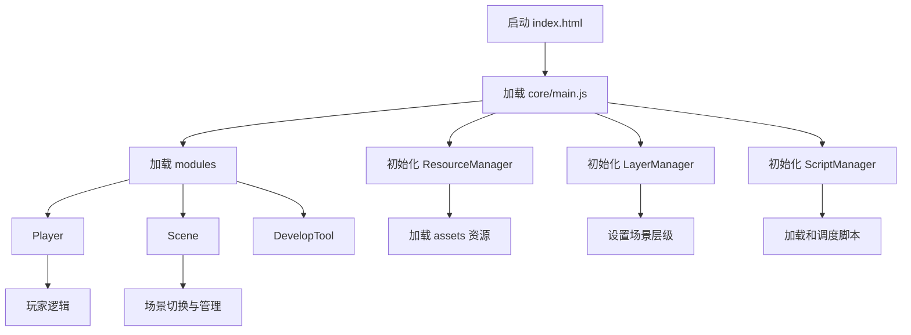
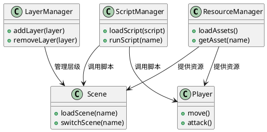

# Terminus 项目代码架构说明

## 目录结构概览

```
Terminus
│
├── assets
│   ├── images
│   ├── models
│   │   ├── enemies
│   │   └── facilities
│   └── sounds
│
├── core
│   ├── main.js
│   ├── managers
│   └── modules
│
├── scripts
│   ├── main.json
│   └── src
│       ├── enemies
│       ├── layers
│       └── renderers
│
├── index.html
├── package.json
├── README.md
├── ...（其他文档与配置文件）
```

## 主要目录与文件说明

### assets/

- **images/**：项目用到的图片资源。
- **models/**：3D 模型资源，分为敌人和设施。
- **sounds/**：音效资源。

### core/

- **main.js**：项目主入口，初始化和启动核心逻辑。
- **managers/**：管理器模块，包括：
  - `LayerManager.js`：负责场景层级管理。
  - `ResourceManager.js`：资源加载与管理。
  - `ScriptManager.js`：脚本调度与管理。
- **modules/**：功能模块，包括：
  - `DevelopTool.js`：开发辅助工具。
  - `Player.js`：玩家相关逻辑。
  - `Scene.js`：场景管理与切换。
  - `RayCaster.js`：射线照明和投射系统。

### scripts/

- **main.json**：主脚本配置文件。
- **src/**：脚本源码，按功能细分：
  - `enemies/`：敌人相关脚本（如 `red_monster.js`）。
  - `layers/`：层级相关脚本（如 `terminal.js`）。
  - `renderers/`：渲染器相关脚本（如 `lidar.js`）。

### 根目录文件

- **index.html**：前端页面入口。
- **package.json**：项目依赖与脚本配置。
- **README.md**：项目简介与使用说明。
- **checkpoint.md, code_struct.md, doc.md, Script.md**：开发文档与说明。
- **typst.pdf, typst.typ**：文档与排版相关文件。
- **vite.config.js**：Vite 构建工具配置。

## 模块关系简述

- `core/main.js` 作为主入口，负责初始化各管理器和模块。
- 管理器（managers）负责资源、层级、脚本等全局调度。
- 功能模块（modules）实现具体业务逻辑，如玩家、场景等。
- `scripts/src/` 下的脚本为具体功能实现，供核心模块调用。
- 资源文件由 `ResourceManager` 加载并分发给各模块使用。

## 项目启动流程图



---

## 主要模块 UML 类图



---
