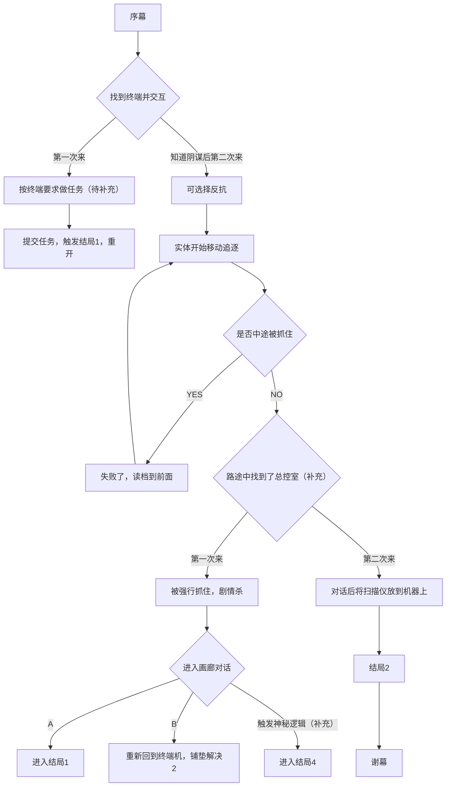

# 剧情推进的流程图

```mermaid
graph TD
    pre[序幕]-->start{找到终端并交互}
    start -->|第一次来| section1_1[按终端要求做任务（待补充）]
    start -->|知道阴谋后第二次来| section2_1[可选择反抗]

    section1_1 --> ending1[提交任务，触发结局1，重开]
    section2_1 --> section2_2[实体开始移动追逐]
    section2_2 --> section2_3{是否中途被抓住}
    section2_3 -->|YES| fail[失败了，读档到前面]
    fail --> section2_2
    section2_3 -->|NO| success{路途中找到了总控室（补充）}

    success --> |第一次来| section3_1[被强行抓住，剧情杀]
    success --> |第二次来| section4[对话后将扫描仪放到机器上]
    
    section3_1 --> section3_2{进入画廊对话}
    section3_2 --> |A| ending11[进入结局1]
    section3_2 --> |B| restart[重新回到终端机，铺垫解决2]
    section3_2 --> |触发神秘逻辑（补充）| ending3[进入结局4]

    section4 --> ending2[结局2]
    ending2 --> final[谢幕]

```