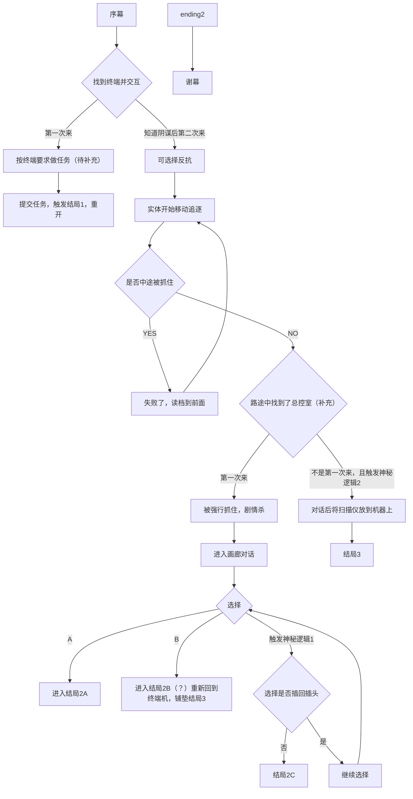

# 剧情推进的流程图

```mermaid
graph TD
    pre[序幕]-->start{找到终端并交互}
    start -->|第一次来| section1_1[按终端要求做任务（待补充）]
    start -->|知道阴谋后第二次来| section2_1[可选择反抗]

    section1_1 --> ending1[提交任务，触发结局1，重开]
    section2_1 --> section2_2[实体开始移动追逐]
    section2_2 --> section2_3{是否中途被抓住}
    section2_3 -->|YES| fail[失败了，读档到前面]
    fail --> section2_2
    section2_3 -->|NO| success{路途中找到了总控室（补充）}

    success --> |第一次来| section3_1[被强行抓住，剧情杀]
    success --> |不是第一次来，且触发神秘逻辑2| section4[对话后将扫描仪放到机器上]
    
    section3_1 --> section3_1_1[进入画廊对话]
    section3_1_1 --> section3_2{选择}
    section3_2 --> |A| ending2A[进入结局2A]
    section3_2 --> |B| restart[进入结局2B（？）重新回到终端机，铺垫结局3]
    section3_2 --> |触发神秘逻辑1| section3_2_1{选择是否插回插头}
    section3_2_1 --> |否| ending2C[结局2C]
    section3_2_1 --> |是| continue[继续选择]
    continue --> section3_2

    section4 --> ending3[结局3]
    ending2 --> final[谢幕]

```
