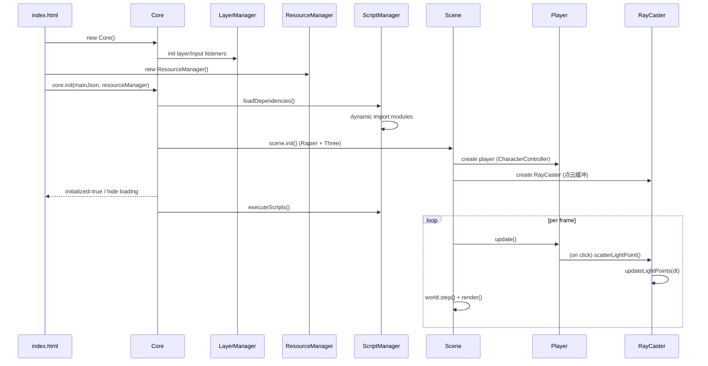
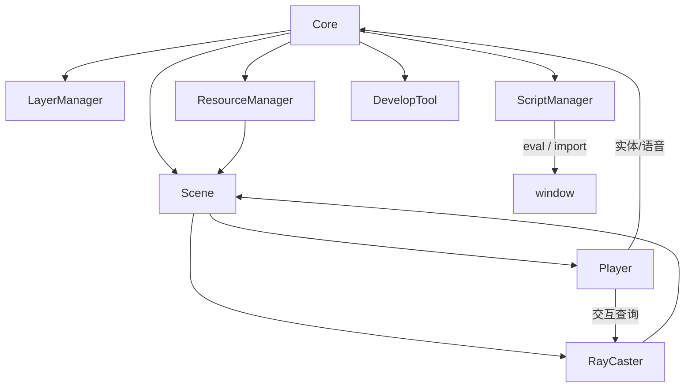

# Terminus 架构说明（更新版）

> 本文与 `API.md` 配套：`API.md` 关注“接口粒度”，此处聚焦“结构 + 设计动机 + 运行流程 + 可扩展点”。

## 0. 设计目标

| 目标         | 说明                                | 现状                      |
| ------------ | ----------------------------------- | ------------------------- |
| 数据驱动     | 用 `main.json` 定义实体/脚本/快捷键 | 已实现（运行时可修改）    |
| 快速迭代     | 动态脚本 + 无构建热加载             | 依赖 ES Module + eval     |
| 可视化调试   | 内置开发者工具+点云可视化           | 已实现基础版              |
| 低耦合输入   | 层级化输入路由                      | 已实现（LayerManager）    |
| 性能演进空间 | 模块划分明确，支持替换              | 预留（点云/脚本可沙箱化） |

## 1. 目录结构（按当前仓库实际）

```
Terminus/
├── assets/
│   ├── models/                # glb 模型（敌人 / 场景设施）
│   └── sounds/                # 音频（BGM / SFX）
├── core/
│   ├── main.js                # Core 类实例 + 入口
│   ├── managers/
│   │   ├── LayerManager.js
│   │   ├── ResourceManager.js
│   │   ├── ScriptManager.js
│   │   └── SoundManager.js
│   └── modules/
│       ├── Scene.js           # Three + Rapier + Lidar 点云
│       ├── Player.js          # 角色控制器（CharacterController）
│       ├── RayCaster.js       # 射线 + 点云调度
│       └── DevelopTool.js     # 调试面板
├── scripts/
│   ├── main.json              # 运行时脚本/实体配置
│   └── src/                   # 业务/扩展脚本
└── docs/                      # 架构 / API / 剧情 / 设计文档
```

演进建议：`core/utils/` 暂未存在，可后续抽取公共数学 / 曲线 / Easing / 事件总线 等。

## 2. 运行主流程



## 3. 模块协作关系



关键解耦：

1. Core 不直接渲染：渲染循环只在 `Scene` 内部。
2. UI 层（终端 / 调试面板等）通过 LayerManager 注入，不侵入场景逻辑。
3. 脚本系统只与 window 通信，可被后续替换为隔离上下文。

## 4. 设计要点与权衡

| 领域     | 现实现状                               | 设计动机                  | 潜在风险 / 后续        | 优化方向                               |
| -------- | -------------------------------------- | ------------------------- | ---------------------- | -------------------------------------- |
| 输入路由 | DOM 全局监听 -> 层栈逆序分发           | 统一快捷键 & pointer lock | 模块未主动解绑可能残留 | 引入事件总线 + 生命周期 hook           |
| 角色控制 | Rapier CharacterController             | 稳定楼梯/坡度/跳跃        | Creative 模式速度写死  | 参数热加载 & 曲线调整 GUI              |
| 点云渲染 | CPU 组装 Float32Array + PointsMaterial | 快速原型 / 可控寿命       | 高点数下主线程压力     | WebWorker 预计算 + Instancing / WebGPU |
| 动态脚本 | eval + 自动补 `window.`                | 兼容简写赋值              | 全局污染 / 安全风险    | 沙箱上下文 (Proxy/VM)                  |
| 实体物理 | GLTF 遍历 -> Trimesh Collider          | 精确贴合模型              | 复杂模型生成成本高     | 体素/凸分解/缓存碰撞数据               |
| 存档     | localStorage JSON 串                   | 简单                      | 无限增长 / 缺少版本    | 版本号 + 压缩 + 签名                   |
| 资源缓存 | Map + clone 材质                       | 避免状态共享              | 未做引用计数           | 引入引用计数 + LRU                     |

### 4.1 Pointer Lock 同步

`pointerlockchange` 事件被 LayerManager 拦截，用于：

1. 更新 `document.mouse_locked`
2. 若解锁且未激活暂停菜单 -> 自动打开对应 UI（兼容 ESC）

### 4.2 脚本重写策略

通过正则在 eval 前把孤立 `identifier =` 替换为 `window.identifier =`，避免 strict mode 下隐式全局赋值报错。该策略：

1. 不处理解构/多重赋值
2. 不处理点访问（如 `obj.x =` 保持原状）
3. 适用于简单配置型脚本

### 4.3 玩家状态缓存

`getPosition()` 返回缓存值并以 16ms 粒度更新，避免在 Rapier 步进期间读写冲突；`savePlayerState()` 周期性写回到 `script.entities` 中 `self` 实体属性，供存档与外部脚本使用。

### 4.4 Lidar 点云设计

1. 单环大数组复用（上限 1.5M 点）
2. 队列分帧写入（`pointsPerFrame` 可调）
3. 寿命 -> 颜色强度衰减（live_long 最低亮度钳制）
4. 行扫描 + 抖动列 -> 构造扫描动画与激光线覆盖
5. Overlay Canvas 分离于 WebGL，避免合成消耗 WebGL 状态切换成本

### 4.5 模型碰撞体刷新

`refreshEntityCollider()` 通过销毁旧 collider + 重新烘焙世界矩阵顶点生成新 Trimesh；适合低频结构变更，不适合高频动画（后续可替换为层级包围盒/凸包）。

## 5. 生命周期（拆解）

| 阶段     | 入口                    | 关键操作                                        | 退出条件              |
| -------- | ----------------------- | ----------------------------------------------- | --------------------- |
| 启动     | `new Core()`            | 绑定全局依赖 (THREE / GLTFLoader / Pathfinding) | 等待 `init`           |
| 初始化   | `core.init(script,res)` | 加载依赖 -> 初始化 Scene -> 关闭 loading        | try/catch 捕获异常    |
| 运行     | `scene.start()`         | RAF 循环 (物理+渲染+点云)                       | `scene.stop()` / 销毁 |
| 自动存档 | `beforeunload`          | `autosavingdata()` 写 localStorage              | 页面关闭              |
| 销毁     | `core.destructor()`     | 调用子模块析构 / 清空引用                       | 完成日志              |

## 6. 扩展点（当前已留接口）

| 类           | 可挂钩方法                            | 用途                      |
| ------------ | ------------------------------------- | ------------------------- |
| Core         | executeScripts 前后                   | 自定义脚本安全网          |
| Scene        | load/remove/saveState                 | 关卡流 / 实体同步         |
| RayCaster    | scatterLightPoint / updateLightPoints | 新扫描模式 / 分布策略     |
| Player       | update / handleInteraction            | 自定义能力 / Buff / HUD   |
| LayerManager | forwardInput / push                   | 输入中间件 / 层可见性管理 |

> 建议：加入一个事件总线（例如 `core.bus.emit('scene:loaded')`）避免脚本直接访问内部私有字段。

## 7. 未来路线图（建议）

| 优先级 | 主题         | 说明                                         | 价值     |
| ------ | ------------ | -------------------------------------------- | -------- |
| 高     | 脚本沙箱     | 统一 `execute` 隔离上下文                    | 安全性   |
| 高     | 点云性能     | Worker + InstancedBufferGeometry             | FPS 稳定 |
| 中     | 资源生命周期 | 引用计数 + LRU 释放                          | 内存占用 |
| 中     | 存档版本化   | `savingdata._version` + 迁移器               | 可升级   |
| 低     | 组件化 UI    | Layer 抽象成 React/Vue/纯函数 Render Adapter | 扩展便利 |

## 8. 术语速查

| 术语           | 含义                                                |
| -------------- | --------------------------------------------------- |
| Entity         | `script.entities` 中定义的一个可加载模型 / 交互对象 |
| Speech         | 叙事/语音触发数据（结构与实体类似，含距离回调）     |
| Lidar 模式     | 关闭光照 + 隐藏几何，仅保留点云扫描感知世界         |
| live_long      | 点云点长期存在（保持最低亮度）标志                  |
| intensity_drop | 点光亮度衰减倍速                                    |

## 9. 与 API 文档的对应

| 本文章节 | API 对应                  | 备注           |
| -------- | ------------------------- | -------------- |
| 2 / 3    | Core / Managers / Modules | 结构+调用顺序  |
| 4        | 设计说明                  | 不在接口层体现 |
| 5        | 生命周期                  | 需事件总线增强 |
| 6 / 7    | 扩展路线                  | 尚未实现部分   |

---

（完）
