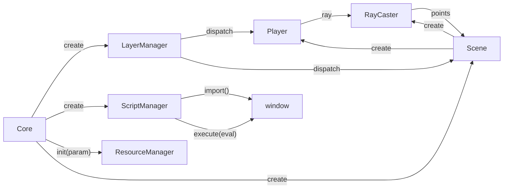
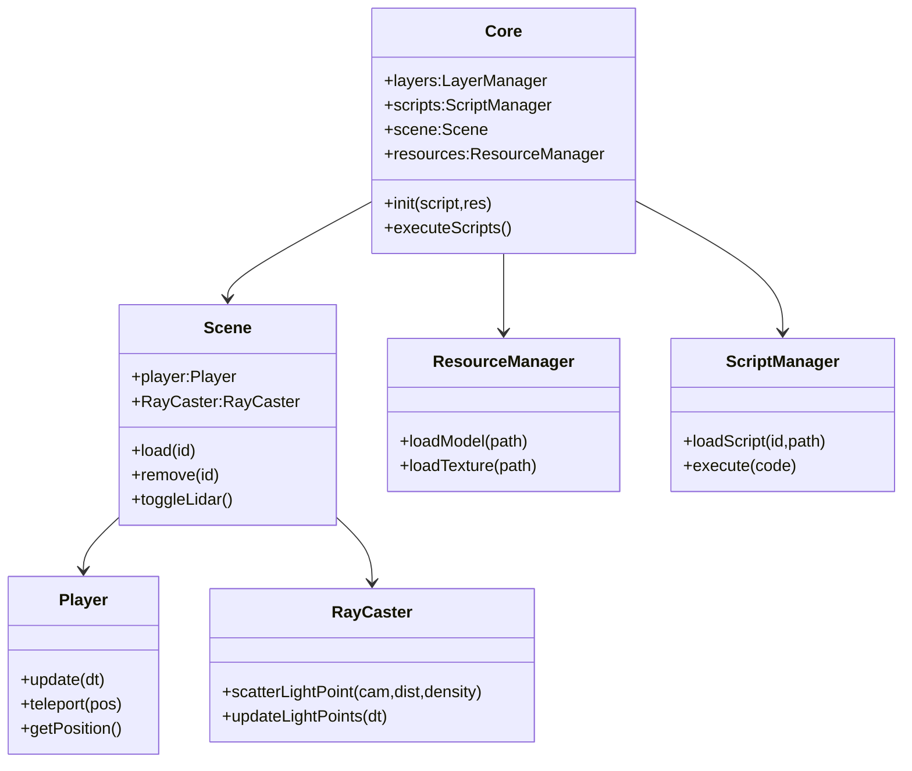

# Terminus 项目代码框架分析（更新版）

> 与 `ARCHITECTURE.md` 不同，这里更偏向“代码级”与“模块交互”细节。

## 1. 实际目录与新增/变更点

```
core/
  main.js                 # Core 类：容器、脚本/依赖执行、全局暴露
  managers/
    LayerManager.js       # 输入事件统一分发 + 层级 DOM
    ResourceManager.js    # GLTF / Texture 缓存 + 去重
    ScriptManager.js      # 动态模块 import + 字符串脚本执行
    SoundManager.js       # BGM / SFX 控制（DOM 基础）
  modules/
    Scene.js              # Three.js + Rapier 世界 + 实体加载 + Lidar 模式
    Player.js             # CharacterController 封装 + 交互/移动
    RayCaster.js          # 射线封装 + 点云/扫描系统 + Overlay 激光
    DevelopTool.js        # 调试信息面板
scripts/
  main.json               # 运行脚本配置（entities / dependencies / scripts / shortcuts）
```

变更说明：
| 文件 | 旧文档状态 | 现状 | 备注 |
|------|------------|------|------|
| SoundManager.js | 未记录 | 已实现 | 纯 DOM `<audio>` 控制 |
| RayCaster.js | 未记录 | 已实现 | 占核心特色，需要重点文档化 |
| Scene.js | 简略 | 扩展含 Lidar Mode / collider 重建 | Rapier 调试渲染嵌套类 |
| Player.js | 未详述 | 使用 CharacterController + 缓存 | Creative 模式 / 交互逻辑 |

## 2. 调用关系（代码级）



输入流：Browser Event -> LayerManager.forwardInput -> (top layer with handleInput) -> Player / Scene。

## 3. 关键模块深入

### 3.1 LayerManager

核心实现要点：

1. 构造时绑定五类事件：`keydown` / `keyup` / `mousemove` / `pointerlockchange` / `click`。
2. `forwardInput` 倒序遍历 layer 栈调用 `module.handleInput(e)`，返回 truthy 则停止继续传播。
3. 快捷键系统：读取 `document.core.script.shortcut`，仅在 `core.script.debug` 为真 && `Ctrl` 按下时触发；使用 `eval(action)`（需后续替换）。
4. PointerLock：解锁时如果暂停 UI 未激活可触发打开逻辑（与游戏菜单耦合点：`window.gameInstance.pauseMenu`）。

### 3.2 ResourceManager

实现策略：
| 场景 | 处理 | 作用 |
|------|------|------|
| 重复加载同路径 | 共享 `loadingPromises` | 合并请求 |
| 返回模型 | 永远 clone | 防止修改共享原始材质 |
| dispose | 遍历 mesh 释放 geometry/material | 内存回收 |

### 3.3 ScriptManager

代码路径：`loadScript()` -> dynamic import + 结果挂到 `window[id]`。
字符串脚本重写：正则 `/([\s;({])([A-Za-z_$][\w$]*)\s*=/` -> `window.xxx =`（过滤保留字 & 前导 `.`）。
降级流程：`executeCall()` 若解析失败 -> 直接 `execute()`。

安全欠缺：可通过脚本访问任意 `window` 对象；建议未来提供白名单上下文 + Proxy 拦截。

### 3.4 Scene

功能段：
| 区块 | 方法 | 说明 |
|------|------|------|
| 初始化 | `init()` | 串行：Rapier -> Renderer -> Scene -> Camera -> Physics -> RayCaster -> Player |
| 实体加载 | `load(entityId)` | GLTF -> 放入 `worldModels` -> 遍历 mesh -> 构建 Trimesh collider（合并顶点世界矩阵） |
| 实体卸载 | `remove(entityId)` | 释放 Three + 移除 collider + 刚体 |
| Lidar 模式 | `activate_lidar()/deactivate_lidar()` | 切换显示与光照 |
| 动画循环 | `animate()` | 更新光点 -> 玩家 -> 物理 -> 可选调试渲染 -> render |
| 调试 | RapierDebugRenderer 内部类 | 物理调试线段 |

Collider 重建：`refreshEntityCollider()` 适合静态物件位置改变后重新贴合（消耗较高）。

### 3.5 Player

核心逻辑序列（`update()`）：

1. `updateGroundState()` -> Rapier controller grounded 检测
2. `handleJumping()` -> 设置纵向速度
3. `updateVelocity()` -> 方向输入 -> 目标速度 -> Lerp 平滑 -> 空中控制系数
4. `applyGravity()` -> creative 模式跳过自然重力
5. `performMovement()` -> `characterController.computeColliderMovement()` -> 位移应用 & 碰撞修正
6. `updateCamera()` -> yaw/pitch 基于鼠标增量
7. 交互：`updateInteraction()`(E 提示) + `updateDistanceInteraction()`(半径触发)
8. 定时器：每 100ms `savePlayerState()` 写回 script.entities.self

Creative 模式：允许自由上下 (Space/ArrowUp / ArrowDown) + 更高速度。

### 3.6 RayCaster

数据结构：
| 名称 | 类型 | 说明 |
|------|------|------|
| positions / colors | Float32Array | 点云位置/当前颜色 |
| baseColors | Float32Array | 初始颜色缓存 |
| lifeTime / lifeRes | Float32Array | 原始寿命 / 剩余寿命 |
| Intensity / lastIntensity | Float32Array | 当前亮度 / 上帧亮度 |
| liveLong | Uint8Array | 是否保持最低亮度 |

扫描流程：

1. 点击 -> `scatterLightPoint()` -> 预生成多行多列方向缓存
2. 分帧逐行释放 -> 每个方向做 Ray -> 命中生成点入队
3. `processPointQueue()` 限流写入 BufferGeometry
4. `updatePoint()` 衰减 -> 更新 attributes.needsUpdate
5. Canvas Overlay 绘制激光线条（lighter 合成）

### 3.7 DevelopTool

非渲染帧逻辑：内部 `setInterval(60Hz)` 拉取 `Scene.animationDeltatime` 估算 FPS（最近 30 帧平均）。显示命中实体与坐标。

## 4. 事件与全局状态

| 全局变量                | 来源                           | 用途                  |
| ----------------------- | ------------------------------ | --------------------- |
| `window.core`           | Core 构造                      | 提供脚本统一入口      |
| `document.core`         | Core 构造                      | LayerManager 快捷访问 |
| `document.mouse_locked` | LayerManager.pointerlockchange | 玩家 / 相机输入条件   |
| `window.THREE`          | main.js                        | 供外部脚本直接使用    |
| `window.GLTFLoader`     | main.js                        | 同上                  |
| `window.Pathfinding`    | main.js                        | 未来路径功能          |

缺失：统一事件系统（当前依赖全局变量+直接互调）。

## 5. 典型调用链示例（实体加载）

```text
脚本: "core.scene.load('main_facility')"
 -> ScriptManager.execute("core.scene.load('main_facility')")
 -> parseMethodCall 成功
 -> resolveObject("core.scene") -> Scene 实例
 -> Scene.load('main_facility')
    -> core.getEntity() 读取配置
    -> resources.loadModel(path) -> clone glTF
    -> 添加到 worldModels
    -> 遍历 mesh 建立 Rapier Trimesh collider
```

## 6. 性能关注点（当前状态）

| 关注点        | 描述                   | 现策略               | 建议                        |
| ------------- | ---------------------- | -------------------- | --------------------------- |
| 点云写入      | 大量点一次进入         | 队列 + 分帧          | Worker + SharedArrayBuffer  |
| GLTF Collider | Trimesh 构建重 CPU     | 直接烘焙世界坐标顶点 | 预处理离线缓存（JSON+索引） |
| 渲染状态切换  | WebGL + Canvas Overlay | Overlay 仅 2D 激光   | WebGL Shader 内合成         |
| 脚本执行      | eval 阻塞主线程        | 简短脚本             | 异步虚拟机 (iframe/channel) |

## 7. 技债清单（短）

1. `Core.destructor()` 未彻底释放 ScriptManager / ResourceManager（注释掉）。
2. `Scene.removeAllEntities()` 调用尚未使用（拼写 `removeEntity` 似乎应为 `remove`）。
3. `Player.savePlayerState()` 写入 rotation 直接访问 `_x/_y/_z`（Three 内部字段）。
4. RayCaster 魔术数字（`pointsPerFrame=30000` / `PointLimit=1_500_000`）应外部配置化。
5. 快捷键系统的节流逻辑基于 `last_shortcut_time`，固定 200ms，可参数化。

## 8. 未来重构入口建议

| 主题         | 切入文件           | 重构策略                                                            |
| ------------ | ------------------ | ------------------------------------------------------------------- |
| 事件总线     | core/main.js       | 新建 `EventBus` (Map<event,Set<fn>>) 注入 core                      |
| 安全脚本     | ScriptManager.js   | 抽象 `ScriptRuntime` 接口 -> 提供 `evalRuntime` 与 `sandboxRuntime` |
| 点云模块化   | RayCaster.js       | 拆分：`PointBuffer` / `ScanPattern` / `OverlayRenderer`             |
| 资源引用计数 | ResourceManager.js | `modelRefs[path]++` / `release(path)`                               |
| 配置热更新   | Core + Scene       | 监听 JSON 热替换 -> diff -> unload / load                           |

## 9. 简易 UML（核心子集）



## 10. 与文档的衔接

| 需求     | 位置            | 本文件指向     |
| -------- | --------------- | -------------- |
| 接口签名 | API.md          | 调用语义详述   |
| 设计动机 | ARCHITECTURE.md | 代码实现补充   |
| 剧情脚本 | Script.md       | 与实体逻辑分离 |

---

（完）
