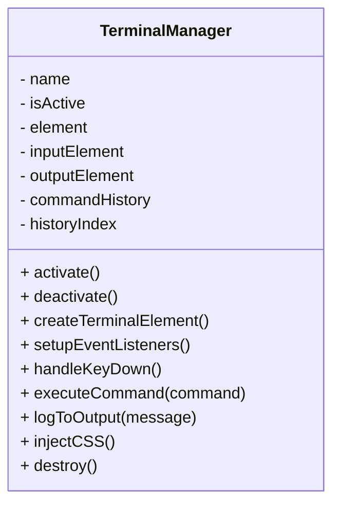
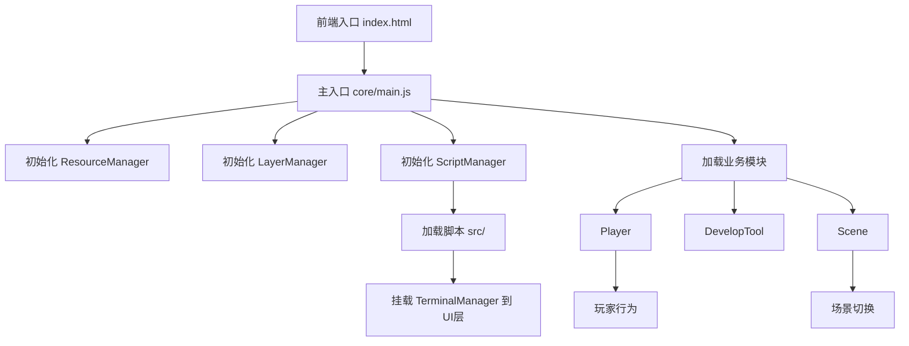

# Terminus 项目代码框架分析

## 1. 项目整体结构

```
Terminus
│
├── assets
│   ├── images
│   ├── models
│   │   ├── enemies
│   │   └── facilities
│   └── sounds
│
├── core
│   ├── main.js                # 项目主入口，初始化各管理器和模块
│   ├── managers               # 全局管理器
│   │   ├── LayerManager.js    # 场景层级管理
│   │   ├── ResourceManager.js # 资源加载与分发
│   │   └── ScriptManager.js   # 脚本调度与管理
│   ├── modules                # 业务功能模块
│   │   ├── DevelopTool.js     # 开发辅助工具
│   │   ├── Player.js          # 玩家相关逻辑
│   │   └── Scene.js           # 场景管理与切换
│   └── utils                  # 工具函数库
│
├── scripts
│   ├── main.json              # 脚本配置文件
│   └── src                    # 领域脚本
│       ├── enemies
│       │   └── red_monster.js # 敌人脚本
│       ├── layers
│       │   └── terminal.js    # UI层终端管理器
│       └── renderers
│           └── lidar.js       # 渲染器脚本
│
├── index.html                 # 前端页面入口
├── package.json               # 项目依赖与脚本配置
├── README.md                  # 项目说明
├── 其他文档与配置文件
```

## 2. 代码分层与流转

- **资源层（assets）**：静态资源，由 ResourceManager 加载。
- **管理层（core/managers）**：负责资源、层级、脚本等全局调度。
- **功能层（core/modules）**：实现具体业务逻辑，如玩家、场景等。
- **脚本层（scripts/src）**：按功能细分，供 ScriptManager 动态加载和调用。
- **前端入口（index.html + core/main.js）**：项目启动与初始化。

## 3. 终端管理器（terminal.js）模块分析

- 位置：`scripts/src/layers/terminal.js`
- 作用：在3D场景上叠加一个可交互的终端界面，支持命令输入、历史、输出等。
- 主要方法：
  - `activate()`：激活终端，创建DOM结构并注入CSS。
  - `deactivate()`：停用终端，移除层和DOM。
  - `createTerminalElement()`：生成终端UI结构。
  - `setupEventListeners()`：设置输入与交互事件。
  - `handleKeyDown()`：处理命令输入与历史。
  - `executeCommand()`：解析并执行命令（如 help、clear、exit、sounds、ui、whoami）。
  - `logToOutput()`：输出日志到终端界面。
  - `injectCSS()`：动态注入终端样式。
  - `destroy()`：销毁终端管理器。

### 终端管理器类结构简图



### 终端模块与主框架关系

- 由 ScriptManager 调度挂载到 UI 层（core.layers），与主场景和玩家模块解耦。
- 通过命令与其他模块（如 sounds、ui）交互，便于扩展。

## 4. 框架流程图



---

如需补充其他模块分析或更详细的UML，请告知。
