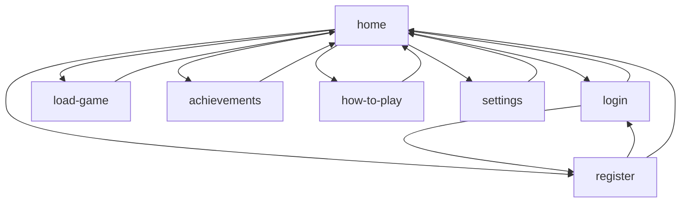
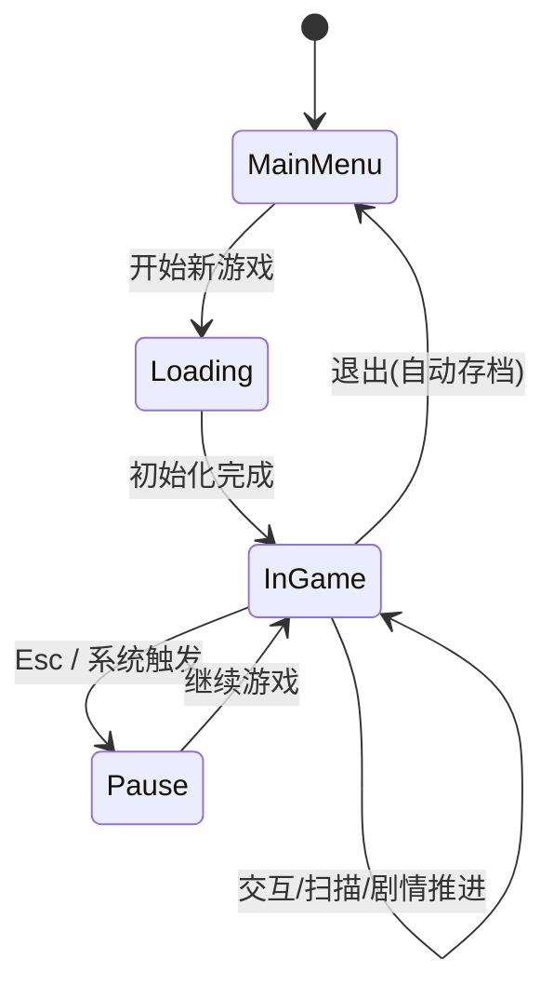
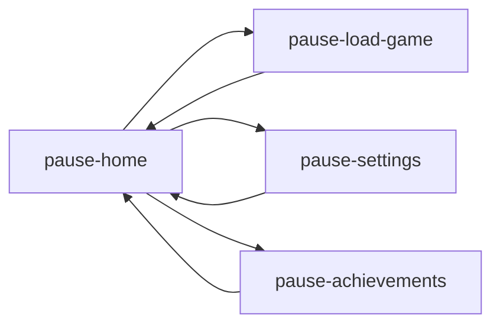

# 站点 / 界面地图 (Terminus)

> 覆盖当前 `index.html` + 游戏运行期层级（主菜单 / 游戏内 / 暂停 / 系统对话框）。

## 1. 顶层结构
```
应用 (Terminus)
├── MainMenu (主菜单容器 #mainmenu)
│   ├── Home (home)
│   ├── 登录 (login)
│   ├── 注册 (register)
│   ├── 加载存档 (load-game)
│   ├── 成就 (achievements)
│   ├── 玩法说明 (how-to-play)
│   └── 设置 (settings)
│
├── GameRuntime (游戏运行区 #gameContainer)
│   ├── LoadingScreen (#loadingScreen)
│   ├── InteractionHint (#interactionHint / #interaction-hint)
│   └── WebGL Canvas + LayerManager 叠加层
│
├── PauseMenuOverlay (#pause-menu-overlay)
│   ├── 已暂停 (pause-home)
│   ├── 加载存档 (pause-load-game)
│   ├── 设置 (pause-settings)
│   └── 成就 (pause-achievements)
│
├── 系统通知 (#notification-box)
├── 确认对话框 (#confirm-dialog-overlay / #confirm-dialog-box)
├── 文本输入对话框 (#prompt-dialog-overlay / #prompt-dialog-box)
└── 音频 (#bgm, #soundEffect)
```

## 2. 页面间导航关系（主菜单）


## 3. 游戏内状态流


## 4. 暂停菜单子导航


## 5. 功能映射表
| 区域 | 主要目的 | 触发方式 | 关键元素 |
|------|----------|----------|----------|
| Home | 品牌/入口 | 打开站点 | 标题/按钮组 |
| 登录/注册 | 账号占位 (未来扩展) | 按钮跳转 | 输入框/确认/返回 |
| 加载存档 | 展示本地存档 | 菜单按钮 | UL 列表 / 动态渲染 |
| 成就 | 展示占位/未来成就 | 菜单按钮 | 文本 + 返回 |
| 玩法说明 | 教学/快捷键 | 菜单按钮 | 文本列表 |
| 设置 | 音量调节 | 菜单按钮 | Range 输入 |
| 游戏区 | 3D 场景 / HUD | 开始游戏 | Canvas + Hint |
| 暂停 | 中断操作 | ESC | 子页面导航 |
| 对话框 | 通知 / 确认 / 输入 | JS 触发 | overlay + box |

## 6. URL / 路由策略
当前为单页面（无 hash / 无历史栈），状态通过 `class="active"` 控制显示。可选后续：
- 使用 `location.hash` 同步主菜单页 (例: `#/settings`)
- 利用 `history.pushState` 支持浏览器返回键。

## 7. 角色 & 权限 (规划)
| 角色 | 可访问页面 | 备注 |
|------|------------|------|
| 未登录 | 所有当前页面 | 登录/注册暂为本地伪实现 |
| 已登录 | 同上 (预留) | 未来区分云存档 |

## 8. 状态依赖 / 数据来源
| 模块 | 数据来源 | 说明 |
|------|----------|------|
| 存档列表 | localStorage (terminus_saves) | 进入 load-page / pause-load-game 动态刷新 |
| 音量设置 | localStorage (settings) | 进入 settings / pause-settings 初始化控件 |
| 成就 | 预留 (future) | 占位文本 |
| 交互提示 | 实体射线检测 | Player + RayCaster 运行帧更新 |

## 9. 站点地图演进建议
1. 拆分“登录 / 注册”为统一 Auth 面板（Tab）。
2. 加入“关于 / Credits / 版本号”。
3. 成就页增加过滤 & 分类（Story / Exploration / Hidden）。
4. 玩法说明拆分“基础 / Debug / 高级技巧”。
5. 可选：错误边界页（WebGL 不支持 / 资源加载失败重试）。

---
（完）
