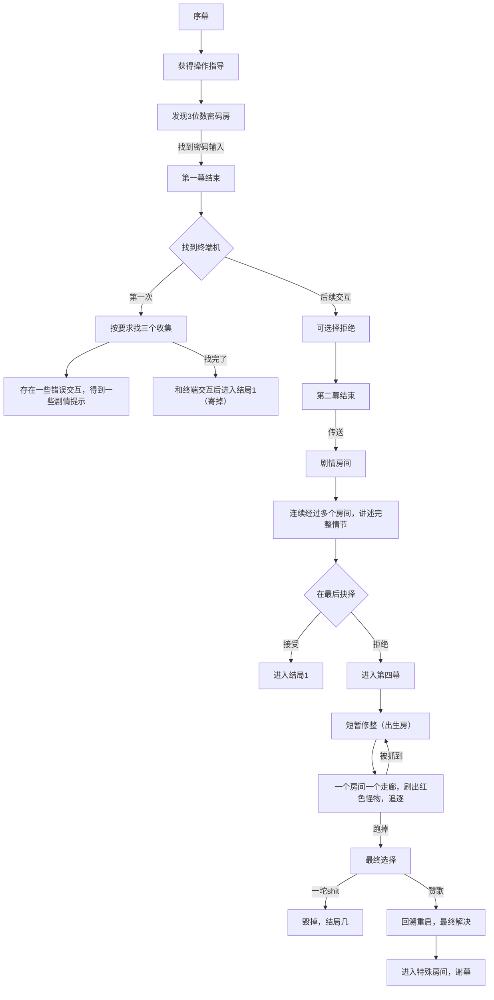
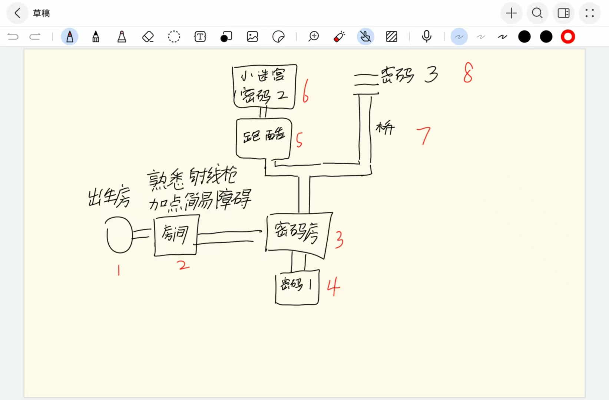
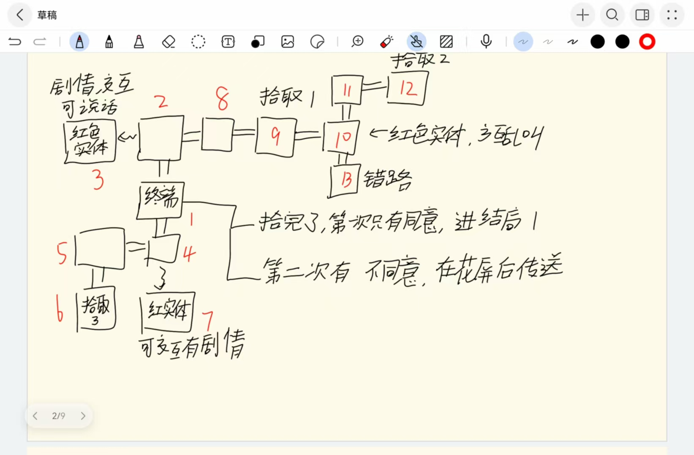
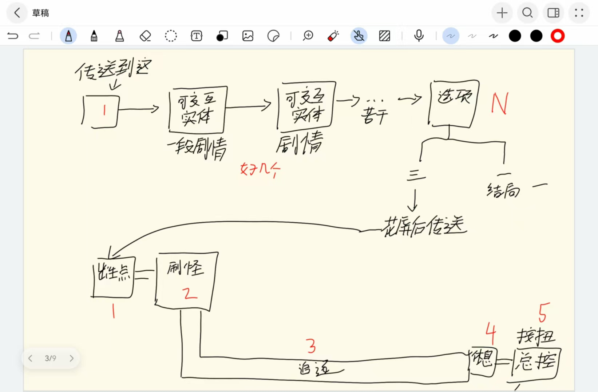
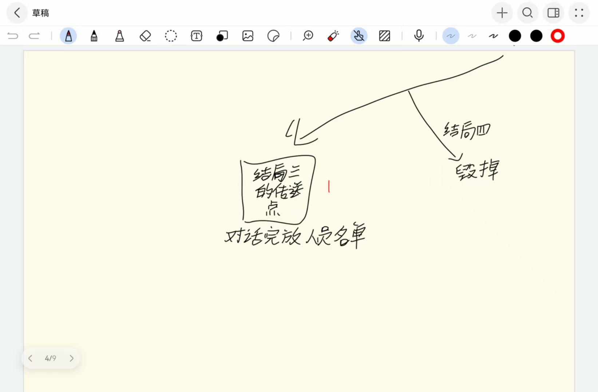

# 剧情推进的流程图

```mermaid
graph TD
    pre[序幕]-->help[获得操作指导]
    help-->password[发现3位数密码房]
    password-->|找到密码输入|find_pwd[第一幕结束]
    find_pwd-->terminal{找到终端机}
    terminal-->|第一次|find_module[按要求找三个收集]
    find_module-->extra[存在一些错误交互，得到一些剧情提示]
    find_module-->|找完了|check[和终端交互后进入结局1（寄掉）]
    terminal-->|后续交互|deny[可选择拒绝]
    deny-->second_end[第二幕结束]
    second_end-->|传送|story_3[剧情房间]
    story_3-->story_get[连续经过多个房间，讲述完整情节]
    story_get-->option{在最后抉择}
    option-->|接受|fail[进入结局1]
    option-->|拒绝|story4[进入第四幕]
    story4-->rest_room[短暂修整（出生房）]
    rest_room-->monster[一个房间一个走廊，刷出红色怪物，追逐]
    monster-->|被抓到|rest_room
    monster-->|跑掉|ending[最终选择]
    ending-->|一坨shit|destory[毁掉，结局几]
    ending-->|赞歌|recover[回溯重启，最终解决]
    recover-->thanks[进入特殊房间，谢幕]
```

第一幕（还剩字体和密码机位置）：

第二幕（暂时是这样）

第三幕加追逐（剧情交互的地方可以再加东西）

第四幕（其实只有一个房间）

