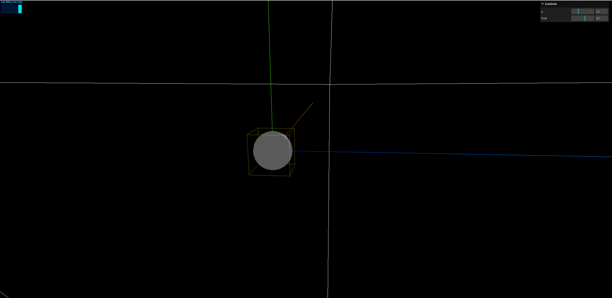
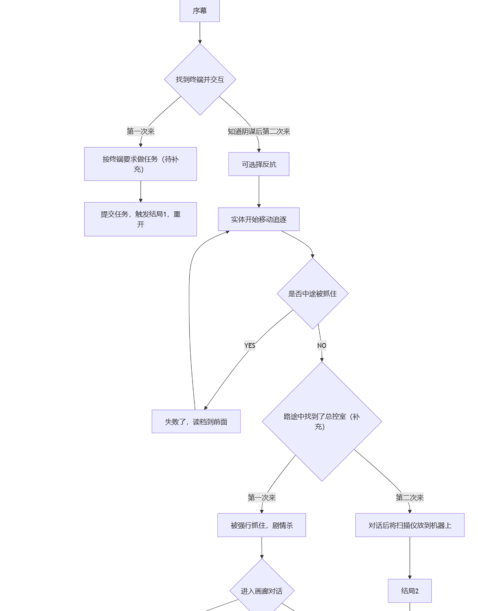

# Week1 日志 

陈家辉-1120243698

## 学习技术栈

小组项目的代码部分主要基于一个名为 `three.js` 的包，我用了一些时间看了下文档，只看了些总览和一些特定的深入章节，搓了一个小玩意：

这个球是用 `blender` 随便划拉搞了一个，上了个光源，摄像头做了前后左右的移动，以及跳跃功能。

目前还需要做的东西很多：

- 给物体加碰撞箱：这个可以用 `box3` 做一个简单的，还没有实操。导入的 demo 的场景有大量的物件，我没有测试性能（~~因为根本没有做~~），demo 的场景在本地能稳定在 120 帧，当然由于我的笔记本有点小问题，不太准确。
- 鼠标控制视角，这个好做，加个事件就可以了。

实际项目还需要做的：

- 交互：分为视角交互和周边的交互：前者将视角定在交互物体上应该有提示，后者在靠近时有提示。
- 碰撞箱：demo 的碰撞箱还没研究，容易卡墙，需要重新设计。

## 项目

目前在剧情和逻辑的讨论阶段，一方面第一版剧情的内容有点少，另一方面故事逻辑不是很清晰，我做了一个线性剧情的流程图（第一版），还需要再沟通做修正：

预计在周末前会完成这一块的工作，分工已经明确了，就可以开始动工了 :)

